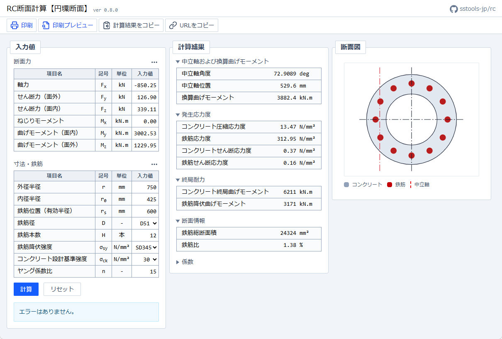

# RC断面計算

鉄筋コンクリート部材について、断面力・寸法・鉄筋条件を入力して計算する Web アプリです。 ([サンプルページ](https://sstools-jp.github.io/rc/?v=LYsxCoAwDEXv0llD2jTV7t7AURwKrSBYBPH-mASXzwt5b3PJDW6cGSGwkA8JMgoQZfBeAAHtRgzAZErIkFWeWD_RwmRWbcf99FYFWWNKFsj08rbnLJfgulDU5F_tPLv9Aw))

## 機能

- 円環断面の各種計算
- 計算結果の印刷
- 計算結果をクリップボードにコピー

## 更新履歴

- [CHANGELOG](CHANGELOG.md)
