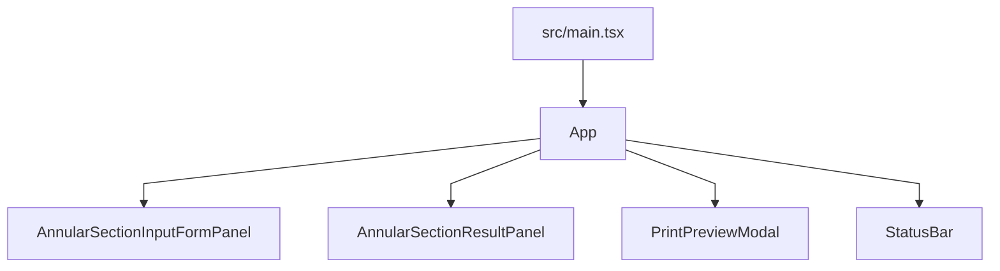
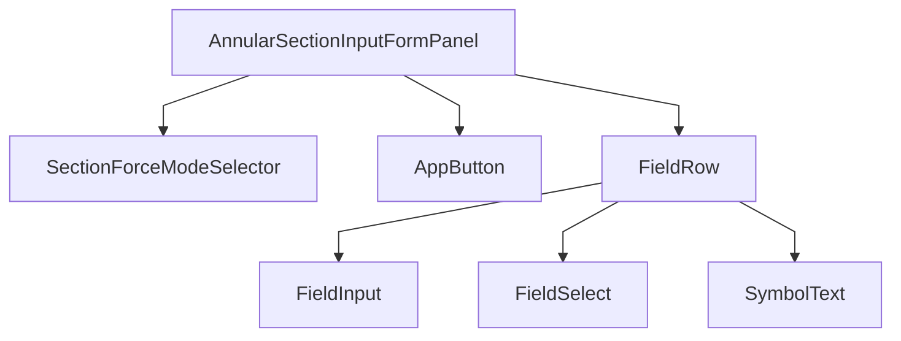
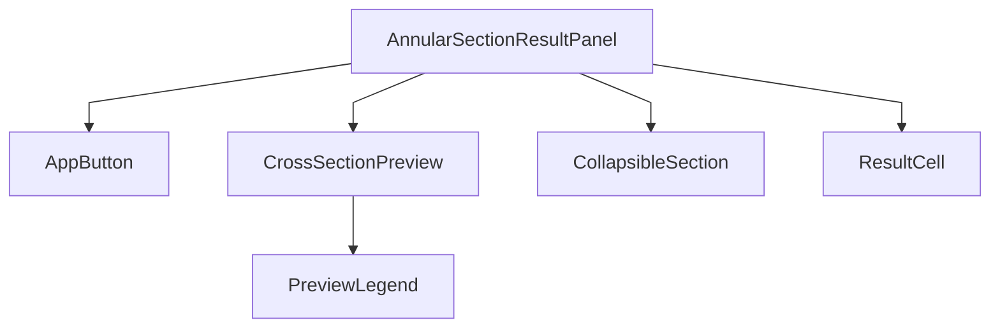
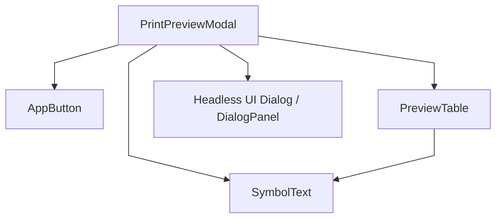

# コンポーネント階層図

この図はアプリ起点の React コンポーネント階層を表す。

`src/main.tsx` から `src/App.tsx` を経由し、画面を構成する各コンポーネントへ展開する。

### 全体構成

### 入力フォーム

### 結果表示

### 印刷プレビュー

## 補足

- [src/components/InputForm.tsx](../src/components/InputForm.tsx)
  - 入力フォーム本体
  - 内部の `FieldRow`、`FieldInput`、`FieldSelect`
- [src/components/ResultPanel.tsx](../src/components/ResultPanel.tsx)
  - 結果表示パネル
  - 折りたたみセクション、断面プレビュー
- [src/components/PrintPreviewModal.tsx](../src/components/PrintPreviewModal.tsx)
  - 印刷プレビュー用のモーダル
  - 印刷・コピー用の操作部品
